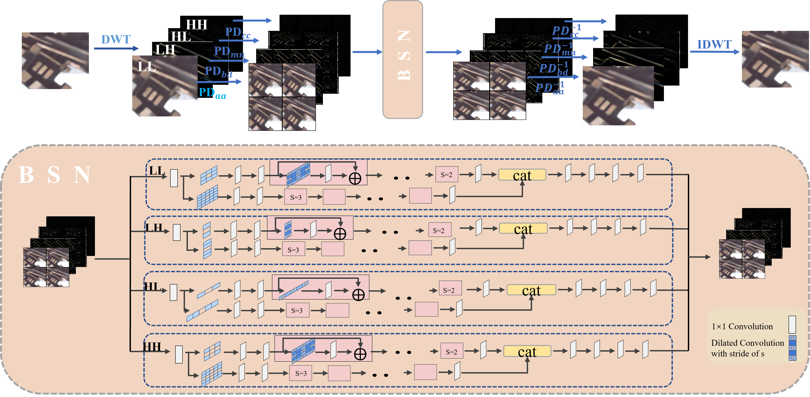

# WA-BSN: Self-Supervised Real-World Image Denoising based on Wavelet-Adaptive Blind Spot Networ

This is an official PyTorch implementation of "WA-BSN: Self-Supervised Real-World Image Denoising based on Wavelet-Adaptive Blind Spot Network" in .




## Abstract
Blind spot network (BSN) has gained increasing at- tention with their state-of-the-art performance in self-supervised image denoising. However, most existing BSN models are based on an unrealistic assumption of noise independence and use isotropic mask convolutions, which can lead to the loss of structural details in the denoised image. To address these limitations, we consider the spatially correlated noise and introduce directional adaptive downsampling and mask convolutions to wavelet domain, resulting in a novel self-supervised denoising method called wavelet-adaptive blind spot network (WA-BSN). Specifically, we design the direction-adaptive pixel-shuffle downsamplings (PDs) and apply them to the wavelet decomposition sub-bands, where the spatial-correlated noise is eliminated and the inherent structure is well preserved in wavelet domain. Then, based on the geometric direction of the wavelet sub-images, we propose four shape-adaptive mask convolutions of smaller size for each wavelet sub-band in WA-BSN. This enables adaptive pixel prediction within a structural neighborhood for each sub-band with reduced training time. Finally, total variation (TV) is added to the loss function to further preserve the edges. The results on public real-world datasets demonstrate that our method significantly outperforms existing self-supervised denoising methods and achieves great efficiency.

[[Paper](https:)]

---

## Setup

### Requirements

Our experiments are done with:

- Python 3.9.5
- PyTorch 1.9.0
- numpy 1.21.0
- opencv 4.5.2
- scikit-image 0.18.1

### Directory

Follow below descriptions to build code directory.

```
AP-BSN
├─ ckpt
├─ conf
├─ dataset
│  ├─ DND
│  ├─ SIDD
│  ├─ NIND
│  ├─ prep
├─ figs
├─ output
├─ src
```

- Make `dataset` folder which contains various dataset.
  - place [DND](https://noise.visinf.tu-darmstadt.de/), [SIDD](https://www.eecs.yorku.ca/~kamel/sidd/), [NIND](https://commons.wikimedia.org/wiki/Natural_Image_Noise_Dataset) datasets at here.
  - `prep` folder contains prepared data for efficient training. (cropped patches with overlapping)
  - how to prepare existing or custom dataset is available at [here](./src/datahandler/prepare_dataset.md).
- Make `output` folder which contains experimental results including checkpoint, val/test images and training logs.
- Recommend to use __soft link__ due to folders would take large storage capacity.

### Pre-trained Models

You can download pretrained checkpoints of our method. Place these files into `ckpt` folder.

| Method |      Dataset   |      Config file     | Pre-trained |
| :----: | :------------: | :------------------: | :---------: |
| AP-BSN |       DND      |     APBSN_DND.yaml   | [APBSN_DND.pth](https://easylink.cc/ovsot7) |
| AP-BSN |      SIDD      |    APBSN_SIDD.yaml   | [APBSN_SIDD.pth](https://easylink.cc/b9nd3q) |


### SIDD Result images (val/benchmark)

Here are the result images of the SIDD validation/benchmark dataset in the main table.

[[validation_images](https://drive.google.com/file/d/1MsCZ6Vy67ON5kOmql7JnjlAnZIzNyIJz/view?usp=sharing)]
[[benchmark_images](https://drive.google.com/file/d/17g7IqIy3GFjERa61A4U1omKGKYrL2PFu/view?usp=sharing)]


## Quick test

To test on a single noisy image with pre-trained AP-BSN in gpu:0.

```
python test.py -c APBSN_SIDD -g 0 --pretrained APBSN_SIDD.pth --test_img ./YOUR_IMAGE_NAME_HERE.png
```

---

## Training & Test

### Training

```
usage: python train.py [-c CONFIG_FILE_NAME] [-g GPU_NUM] 
                       [-s SESSION_NAME] [-r] [--thread THREAD_NUM]

Train model.

Arguments:      
  -c CONFIG_FILE_NAME              Configuration file name. (only file name in ./conf, w/o '.yaml') 
  -g GPU_NUM                       GPU ID(number). Only support single gpu setting.
  -s SESSION_NAME      (optional)  Name of training session (default: configuration file name)
  -r                   (optional)  Flag for resume training. (On: resume, Off: starts from scratch)
  --thread THREAD_NUM  (optional)  Number of thread for dataloader. (default: 4)
```

You can control detail experimental configurations (e.g. training loss, epoch, batch_size, etc.) in each of config file.

Examples:

```
# Train AP-BSN for the SIDD dataset using gpu:0
python train.py -c APBSN_SIDD -g 0

# Train AP-BSN for the DND dataset with session name "MyAPBSN_DND" using gpu:0 and keep training (resume)
python train.py -c APBSN_DND -g 0 -s MyAPBSN_DND -r
```

### Test

```
usage: python test.py [-c CONFIG_FILE_NAME] [-g GPU_NUM] 
(model select)        [-e CKPT_EPOCH] [--pretrained MODEL] 
                      [-s SESSION_NAME] [--thread THREAD_NUM] [--test_img IMAGE] [--test_dir DIR]

Test dataset or a image using pre-trained model.

Arguments:      
  -c CONFIG_FILE_NAME              Configuration file name. (only file name in ./conf, w/o '.yaml') 
  -g GPU_NUM                       GPU ID(number). Only support single gpu setting.
  -e CKPT_EPOCH                    Epoch number of checkpoint. (disabled when --pretrained is on)
  --pretrained MODEL   (optional)  Explicit directory of pre-trained model in ckpt folder.
  -s SESSION_NAME      (optional)  Name of training session (default: configuration file name)
  --thread THREAD_NUM  (optional)  Number of thread for dataloader. (default: 4)
  --test_img IMAGE     (optional)  Image directory to denoise a single image. (default: test dataset in config file)
  --test_dir DIR       (optional)  Directory of images to denoise.
```

You can also control detail test configurations (e.g. on/off R^3, test dataset, etc.) in each of config file.

Examples:

```
# Test SIDD dataset for 20 epoch model in gpu:0
python test.py -c APBSN_SIDD -g 0 -e 20

# Test SIDD dataset for pre-trained model (./ckpt/APBSN_SIDD.pth) in gpu:0
python test.py -c APBSN_SIDD -g 0 --pretrained APBSN_SIDD.pth

# Test a image (./sample_image.png) with pre-trained SIDD AP-BSN in gpu:0 (image will be saved at root directory of project)
python test.py -c APBSN_SIDD -g 0 --pretrained APBSN_SIDD.pth --test_img ./sample_image.png

# Test images in a folder (./test/*)
python test.py -c APBSN_SIDD -g 0 --pretrained APBSN_SIDD.pth --test_dir ./test
```

---

## Results

### Quantitative results

Here is reported results of AP-BSN. Please refer our paper for more detailed results.


### Qualitative results


## Reference

```
@inproceedings{lee2022apbsn,
  title={AP-BSN: Self-Supervised Denoising for Real-World Images via Asymmetric PD and Blind-Spot Network}, 
  author={Lee, Wooseok and Son, Sanghyun and Lee, Kyoung Mu},
  booktitle={Proceedings of the IEEE/CVF Conference on Computer Vision and Pattern Recognition (CVPR)},
  year={2022}
}
```

---

### Update log

- (22.04.15) fixed a bug of single image test without dataset, and update test code for entire image folder.
- (22.05.13) upload result images of the SIDD validation/benchmark dataset.

## Acknowledgement

The codes are based on [AP-BSN](https://github.com/wooseoklee4/AP-BSN). Thanks for their awesome works.
